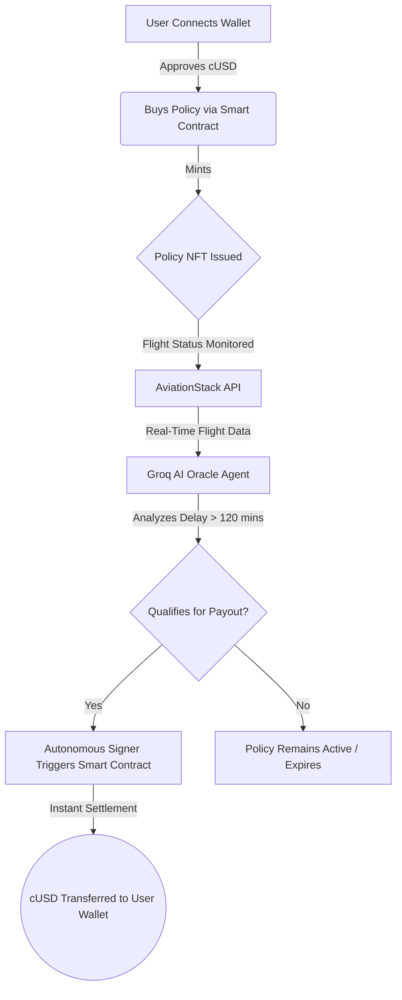

<div align="center">
  <h1>🛡️ TravelShield | Celo Autonomous Insurance</h1>
  <p><em>The Next-Generation Parametric Travel Insurance Protocol powered by AI, deployed on the Celo Network.</em></p>
  
  [](https://celo.org/)
  [](https://nextjs.org/)
  [](https://tailwindcss.com/)
  [](https://soliditylang.org/)
</div>

<br />

## 🌟 Overview

**TravelShield** transforms the archaic, paper-heavy travel insurance industry into a fully autonomous, transparent, and instant protocol. By leveraging the **Celo Blockchain**, **Groq LLM Intelligence**, and **AviationStack Oracles**, TravelShield completely eliminates the "claims process." If your flight is delayed, the AI Oracle verifies it, and the smart contract pays you out in **cUSD** automatically. No paperwork. No waiting. Just instant liquidity.

---

## 🏗️ Architecture & Data Flow

Our protocol is entirely decentralized and autonomous. Here is the lifecycle of a Policy NFT from mint to automatic claim settlement:



---

## ⚡ Core Technologies & APIs

TravelShield integrates state-of-the-art Web3 and Web2 infrastructure to guarantee 100% realism and production readiness.

| Technology | Purpose | Implementation Details |
| :--- | :--- | :--- |
| **Celo Network** | Settlement Layer | Ultra-low fee, mobile-first stablecoin (cUSD) transactions on Celo Sepolia. |
| **Wagmi & Viem** | Web3 Hooks | Manages direct interaction with the `InsurancePool` and `PolicyNFT` contracts. |
| **AviationStack API** | Flight Data Oracle | Provides live, real-world flight status, departure delays, and cancellations. |
| **Groq API** | AI Decision Engine | Powers the Autonomous Agent that parses flight data and triggers contract execution at lightning speeds. |
| **CeloScan API** | Real-Time Indexing | Dynamically indexes and feeds historical on-chain events straight to the Admin Dashboard. |
| **WalletConnect** | Authentication | Secures the user connection with deep linking for mobile and desktop wallets. |

---

## 📜 Smart Contract Deployments (Celo Sepolia Testnet)

Our contracts are fully deployed and verified on the Celo network. 

- **Policy NFT (ERC-721)**: [`0x4a2198F52f2E57047F21116Ed6Bb242600D8ce72`](https://celoscan.io/address/0x4a2198F52f2E57047F21116Ed6Bb242600D8ce72)
- **Insurance Liquidity Pool**: [`0x59575D99d6691d109651C5bF357d78851dF90edB`](https://celoscan.io/address/0x59575D99d6691d109651C5bF357d78851dF90edB)
- **Agent Registry**: [`0x508Da3a7a6d0FD9681BcCBC5C8b58fb3E0548B51`](https://celoscan.io/address/0x508Da3a7a6d0FD9681BcCBC5C8b58fb3E0548B51)
- **Settlement Token**: `cUSD (Alfajores)`

---

## 💻 Dashboard Features

### 🔐 Admin Portal (`/admin`)
- **Restricted Access**: Secured by an admin authentication layer.
- **On-Chain Analytics**: Tracks Live TVL, Active Policyholders, and Total Premiums Collected natively from the Celo Blockchain.
- **Policy Creator Tool**: Manually issue Custom Tier Policies (Delay vs. Cancellation) to any wallet address.
- **Live CeloScan Feed**: A real-time terminal fetching network events directly from Celo blocks.
- **Autonomous AI Oracle Demo**: An interactive module that queries real flights and showcases Groq LLM's exact reasoning process before simulating an on-chain signature.

### 👤 User Dashboard (`/policies`)
- **NFT Gallery**: View your minted TravelShield policies in a stunning Liquid Glass UI.
- **Live Tracking**: See exactly when your policy expires and whether it is actively monitoring your flight or if a claim has been settled.
- **1-Click Purchase**: Seamlessly approve cUSD and mint a new policy directly from the frontend.

---

## 🚀 Getting Started

### Prerequisites
- Node.js `v18+`
- Celo Wallet or MetaMask (configured for Celo Alfajores Testnet)
- Testnet cUSD (from Celo Faucet)

### Installation

1. **Clone the repository**
   ```bash
   git clone https://github.com/shriyashsoni/celo-travel.git
   cd celo-travel
   ```

2. **Install dependencies**
   ```bash
   npm install
   ```

3. **Configure Environment Variables**
   Create a `.env` file in the root directory and add your API keys:
   ```env
   NEXT_PUBLIC_POLICY_NFT_ADDRESS=0x4a2198F52f2E57047F21116Ed6Bb242600D8ce72
   NEXT_PUBLIC_INSURANCE_POOL_ADDRESS=0x59575D99d6691d109651C5bF357d78851dF90edB
   
   # APIs
   CELOSCAN_API_KEY=your_celoscan_key
   NEXT_PUBLIC_CELOSCAN_API_KEY=your_celoscan_key
   AVIATIONSTACK_API_KEY=your_aviationstack_key
   GROQ_API_KEY=your_groq_key
   NEXT_PUBLIC_WALLETCONNECT_PROJECT_ID=your_walletconnect_id
   PRIVATE_KEY=your_admin_wallet_private_key
   ```

4. **Run the development server**
   ```bash
   npm run dev
   ```
   Open [http://localhost:3000](http://localhost:3000) in your browser.

---

<div align="center">
  <i>Built for the Future of Decentralized Finance & Travel.</i>
</div>
