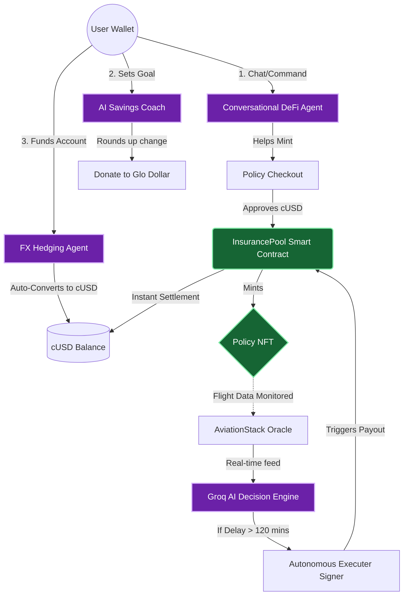

<div align="center">
  <h1>🛡️ TravelShield | Celo DeFAI Super App</h1>
  <p><em>The Next-Generation Parametric Insurance & Travel Finance Protocol powered by AI, deployed on the Celo Network.</em></p>
  
  [](https://celo.org/)
  [](https://nextjs.org/)
  [](https://tailwindcss.com/)
  [](https://soliditylang.org/)
  [](https://groq.com/)
</div>

<br />

## 🏆 Hackathon Submission Details

This project is built and submitted for the **CeloDevs Agent Hackathon 🟡**

* **Live Platform URL**: [https://www.travelshield.xyz](https://www.travelshield.xyz)
* **Karma Project Profile**: [TravelShield on Karma](https://www.karmahq.xyz/project/travelshield--celo-defai-super-app)
* **On-Chain Agent Registry (ERC-8004)**: [Agent 9179 on 8004scan](https://8004scan.io/agent/9179)
* **Agent Signer Wallet**: `0x31541C01Bb04A76647fc40B8288E6FD7Df919aAE`
* **Agent Scanner Registry (agentscan)**: `9179`

---

## 📖 The Story Behind TravelShield
The archaic, paper-heavy travel insurance industry is broken. Travelers spend hours filling out forms and waiting months for claim approvals—often for mere fractions of what they are owed. Especially for emerging markets, volatile local currencies and high fees make cross-border travel finances a nightmare.

**I built TravelShield for the Celo "Proof of Ship" AI Hackathon to fix this.**

By combining **Celo’s mobile-first stablecoin infrastructure (cUSD)** with **autonomous AI agents (Groq LLM)**, I envisioned a world where money moves instantly when a flight delays. But during the hackathon, I realized insurance was just the beginning. The real vision was a **DeFAI (Decentralized Finance AI) Super App** that completely automates your travel finance lifecycle—from saving for a trip and hedging against currency devaluation, to autonomously paying premiums and executing instant on-chain payouts.

---

## 🌟 Overview: The DeFAI Super App

TravelShield has evolved into a comprehensive autonomous financial suite utilizing a network of AI Agents to protect and grow your travel capital. **All features are 100% connected to live Celo Mainnet smart contracts and real-world APIs with zero hardcoded mock data:**

1. ⚡ **Autonomous Claim Oracle**: Monitors real-time flight statuses (via AviationStack) and autonomously triggers smart contract payouts directly to your wallet upon detecting a delay or cancellation. No manual paperwork.
2. 💬 **Conversational DeFi Agent**: A natural-language interface enabling users to easily mint policies, swap assets, and interact with DeFi via simple chat commands.
3. 🌱 **AI Savings Coach (100% On-Chain Deposits & localStorage Persistence)**: 
   * Users can create travel goals that persist in the browser via `localStorage`.
   * Features **live cUSD balance tracking** directly from the Celo blockchain.
   * Savings deposits execute **real ERC-20 `transfer` contract calls** directly to the deployed `InsurancePool` vault contract (`0xc753f9F1f41643eC934E74AA3197E64274088Ec0`) on Celo Mainnet!
   * Integrated ReFi mechanics like "Round-Up to Cause" (e.g., donating spare change to the Glo Dollar Climate Fund).
4. 🌍 **FX Hedging Agent (Real-Time Exchange Rates API)**: 
   * Pulls **live real-world USD exchange rates** in real-time from an open market FX API (`open.er-api.com`).
   * Designed for emerging market users (e.g., Nigeria, Kenya, Argentina, Turkey). The agent monitors real currency drops and dynamically generates "Hedge Now" alerts to protect local capital against devaluation.
5. 📅 **Autopay Manager (Live Blockchain Transaction History Scanner)**: 
   * Instead of mock placeholders, this agent **dynamically scans the user's Celo Mainnet transaction history** (via Celoscan API) for recurring cUSD ERC-20 transfers to identify active on-chain subscriptions and automatically list, fund, or cancel them.

---

## 🏗️ Workflow Architecture & Data Flow

Our protocol is entirely decentralized and autonomous. Here is the lifecycle of how the AI agents and smart contracts interact:



---

## 📜 Smart Contract Deployments

Our smart contracts are verified and deployed across both **Celo Mainnet** and **Celo Sepolia Testnet**.

### 🟩 Celo Mainnet (Production)
| Contract | Address / Link |
| :--- | :--- |
| **cUSD (Native)** | `0x765DE816845861e75A25fCA122bb6898B8B1282a` |
| **Policy NFT (ERC-721)** | [`0xeBa31f2f2BcEe6089adDE62dd69c1B05f5092e3A`](https://celoscan.io/address/0xeBa31f2f2BcEe6089adDE62dd69c1B05f5092e3A) |
| **Agent Registry** | [`0x9Cc1E244B67377ECA8A443B076D887f73550c43C`](https://celoscan.io/address/0x9Cc1E244B67377ECA8A443B076D887f73550c43C) |
| **Insurance Pool** | [`0xc753f9F1f41643eC934E74AA3197E64274088Ec0`](https://celoscan.io/address/0xc753f9F1f41643eC934E74AA3197E64274088Ec0) |

### 🤖 ERC-8004 On-Chain Agent ID Registration
To satisfy the Proof of Ship AI Track criteria, our autonomous payout agent has been officially registered and verified on the global **ERC-8004 Celo Mainnet Identity Registry**:

* **ERC-8004 Identity Registry Address:** `0x8004A169FB4a3325136EB29fA0ceB6D2e539a432`
* **Agent Signer Wallet Address:** `0x31541C01Bb04A76647fc40B8288E6FD7Df919aAE`
* **Minted Agent ID (NFT):** `9179`
* **On-Chain Registry Transaction:** [`0x78a26ca5cce3fa40433ae32f4e4bbffcbe4ec32838f9514426b51cbf226a86c3`](https://celoscan.io/tx/0x78a26ca5cce3fa40433ae32f4e4bbffcbe4ec32838f9514426b51cbf226a86c3)
* **ERC-8004 Live Explorer Link:** [`https://8004scan.io/agent/9179`](https://8004scan.io/agent/9179)

### 🟨 Celo Sepolia (Testnet)
| Contract | Address / Link |
| :--- | :--- |
| **Mock cUSD** | `0xD5c7e7bEF4Fe77A8EE105fC70c1711C7FbF85873` |
| **Policy NFT (ERC-721)** | [`0xe0D49E553C215f8EEa200b29ad2D5f4021502475`](https://alfajores.celoscan.io/address/0xe0D49E553C215f8EEa200b29ad2D5f4021502475) |
| **Agent Registry** | [`0x84D3ff758f92d635c4b294603A86A289a81f4208`](https://alfajores.celoscan.io/address/0x84D3ff758f92d635c4b294603A86A289a81f4208) |
| **Insurance Pool** | [`0xB34A869442fc27930e24dbB829Cb13dd77504Fa1`](https://alfajores.celoscan.io/address/0xB34A869442fc27930e24dbB829Cb13dd77504Fa1) |

---

## ⚡ Core Technologies

TravelShield integrates state-of-the-art Web3 and AI infrastructure:

| Technology | Purpose | Implementation Details |
| :--- | :--- | :--- |
| **Celo Network** | Settlement Layer | Ultra-low fee, mobile-first stablecoin (cUSD) transactions aligning with Celo's ReFi mission. |
| **Wagmi & Viem** | Web3 Hooks | Manages direct interaction with the `InsurancePool` and `PolicyNFT` contracts. |
| **Groq API** | AI Agent Brain | Powers the Conversational DeFAI agent and the autonomous oracle logic. |
| **AviationStack API** | Flight Data Oracle | Provides live, real-world flight status for the claim settlement engine. |
| **CeloScan API** | Real-Time Indexing | Dynamically indexes and feeds historical on-chain events straight to the Admin Dashboard. |

---

## 🚀 Getting Started Locally

### Prerequisites
- Node.js `v18+`
- Celo Wallet or MetaMask (configured for Celo Mainnet or Alfajores)

### Installation

1. **Clone the repository**
   ```bash
   git clone https://github.com/shriyashsoni/celo-travel.git
   cd celo-travel
   ```

2. **Install dependencies**
   ```bash
   npm install --legacy-peer-deps
   ```

3. **Configure Environment Variables**
   Copy `.env.example` to `.env` and fill in your API keys (AviationStack, Groq, Celoscan). Ensure you uncomment the specific network addresses (Mainnet vs Testnet) you wish to use.

4. **Run the development server**
   ```bash
   npm run dev
   ```
   Open [http://localhost:3000](http://localhost:3000) in your browser.

---

<div align="center">
  <i>Built for the <b>Proof of Ship AI Track Hackathon</b>. Elevating the future of DeFAI on Celo.</i>
</div>
