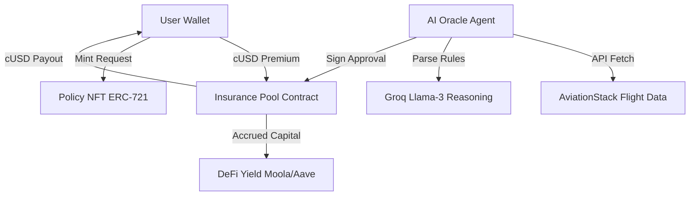

TravelShield achieves autonomous payouts by combining robust smart contracts with decentralized AI Agents.

## System Architecture

## Purchase Workflow

1. **Allowance Granted:** The user approves the `InsurancePool` contract to withdraw `cUSD` token.
2. **Policy Minting:** The user calls `mintPolicy` on `PolicyNFT` passing flight specifications.
3. **Premium Transfer:** The `PolicyNFT` contract queries `InsurancePool` to lock premium funds into the TVL reserve pool.

## AI Oracle & Payout Workflow

Unlike static oracles, TravelShield uses dynamic reasoning agents to double-check conditions, protecting liquidity against corrupt API reports.

1. **Flight Monitoring:** Periodic chron-jobs trigger AI agent to check Flight status on AviationStack endpoint.
2. **LLM Analysis:** If a delay is detected, the flight details are sent to Groq's LLM runtime. The LLM validates that the delay length qualifies under policies conditions.
3. **On-chain Release:** The oracle agent signs a message and calls `triggerPayout` on the `InsurancePool` contract, executing a direct transfer of cUSD.
